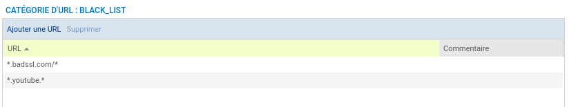
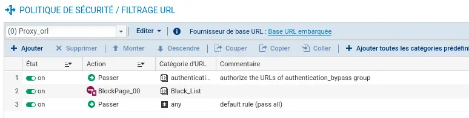
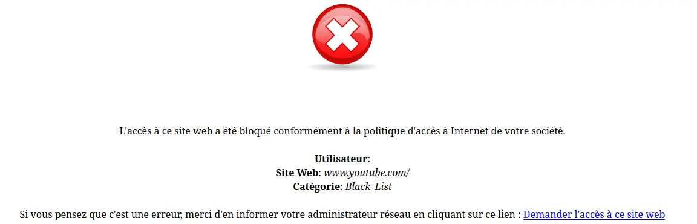
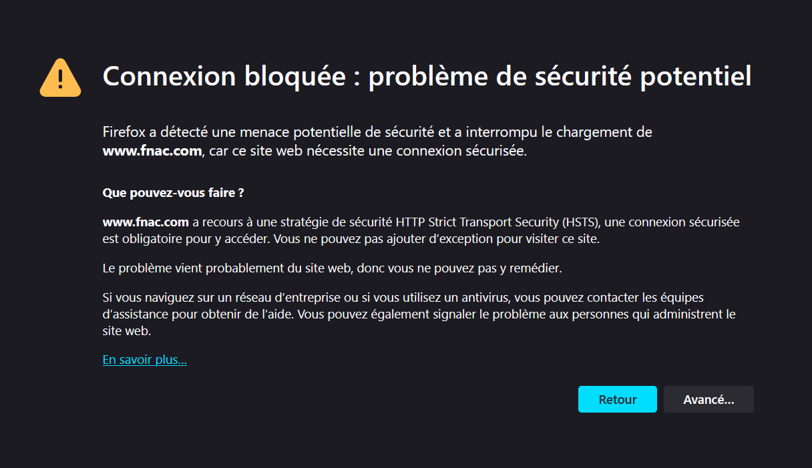
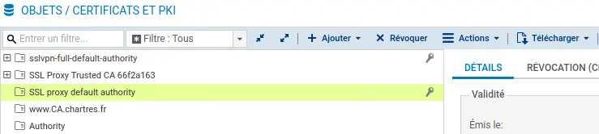
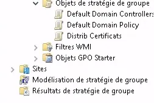
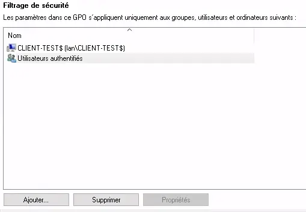
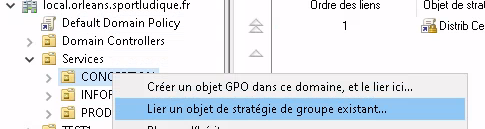
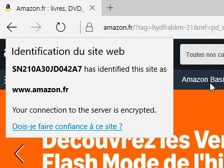

# Certificat SSL 

afin de securiser notre réseau de potentiel visites de  site web interdit nous allons utiliser du filtrage applicatif 

## Pour cela nous allons configurer différents services :

### Création d'une base d'URL : 

#### nous avons créer une catégorie "Black_List" et nous avons ajouter des URL interdit comme par exemple en ecrivant dans la fenètre suivante 

#### Nous allons maintenant ajouter notre categorie Black_List dans nos politique de filtrage URL.

  Nous avons selectionner l'affichage de la "BlockPage_00" pour tout URL présent dans la catégorie "Black_List".

#### Et quand nous essayons d'entrer sur le site de youtbe nous avons cette page :

# Nous allons maintenant ajouter le certificat du stromshield.

## Afin d'acceder à internet depuis notre LAN nous devons avoir le certificat du Stormshield sur le poste sinon cette page apparait :

### Sur le Stormshield nous allons donc aller chercher le certificat.

 Dans <B> Configuration/Objet/Certificat et PKI</B>.  
 Puis on selectionne le certificat du FireWall et on le télécharge.

### une fois que nous avons notre certificat nous allons deployer une GPO afin que nos utilisateurs puissent accéder aux différents sites web .

Nous allons donc aller dans l'outils de gestion de stratégies de groupe puis <B>Objet de stratégies de groupe</B>

Dans les <B>Objet de stratégies de groupe</B> créer une nouvelle stratégie et nommer là : 

Nous allons faire un clique droit sur la stratégie puis nous allons naviguer dans :  
<B>Configuration Ordinateur / Stratégies / Paramètres Windows / Paramètres de sécurité / stratégies de clé publique  </B>  

En faisant un clique droit sur <B>Autorités de certification racines de confiance</B> nous pouvons cliquer sur <B>Importer</B>  

Dans l'assistant cliquer sur <B>Suivant</B> puis choisir notre certificat dans <B>Parcourir</B> puis cliquer sur suivant jusqu'a ce que l'assistant se ferme.  

Maintenant que le certifiat importer nous allons définir que l'on applique la régle sur les ordinateurs du domaine :

Maintenant notre GPO est créer nous allons donc pouvoir l'attribuer au groupe d'utilisateurs souhaiter en faisant un clique droit sur le groupe puis nous allons cliquer sur <B> Lier un objet de stratégie de groupe existant...</B>

Puis on selectionne la tratégie que l'on vient de créer dans le groupe et on clique sur <B>OK</OK> pour valider.

### Nous allons maintenant pouvoir tester sur un utilisateur de l'AD.

En essayant d'accéder au site <B> Amazon</B> depuis <B>Edge</B> nous pouvons voir que le FireWall apparait dans l'autorité de certification.

