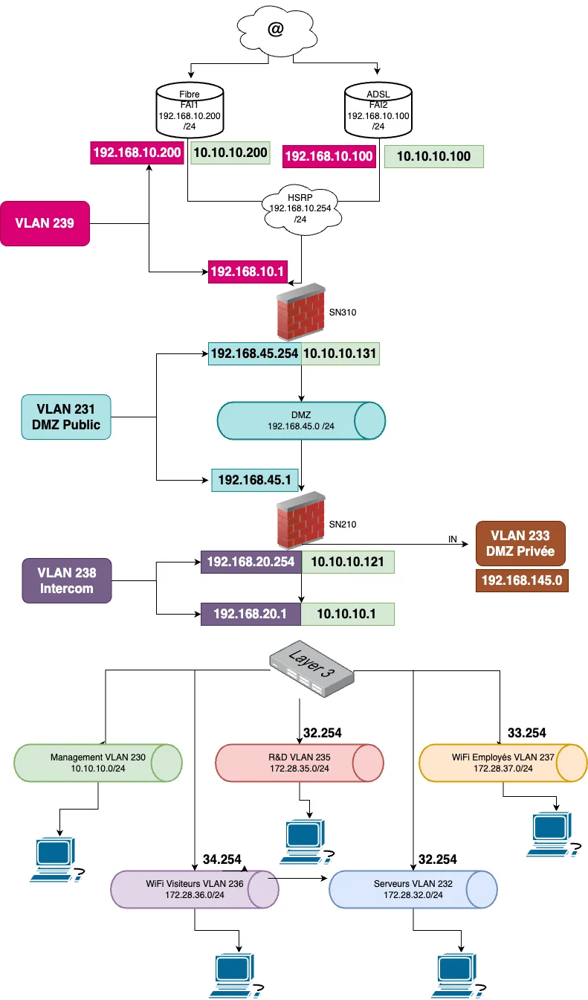
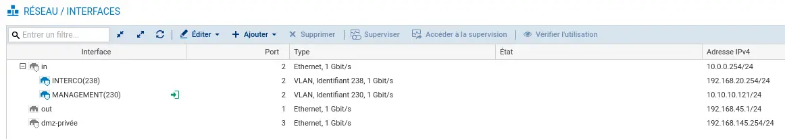

# Firewall

#### Accéder à l’interface de gestion du firewall Stormshield

Pour commancer la configuraton de notre <b>Firewall</b> nous devons le configurer en passant par l'interface web avec l'IP <b>10.0.0.254</b> une page de connection s'affiche et nous pouvons maintenant effectuer les modifications que l'on souhaite.

#### Pour configurer les interfaces.

Pour rappel voici le shema réseau :

Nous devons adapter la configuration pour les deux <strong>Firewall</strong> 

Dans le menu : <strong> configuration/RESEAU/Interfaces</strong>

Nous avons ensuite modifier les interfaces :

### Pour le SN-210

L'interface <strong>in</strong> a toujours l'IP 10.0.0.254/24 (IP de base) en cas de perte de controle sur le <strong>Firewall</strong> cependant nous avons ajouter les vlan d'interconnection (238) et de management (230) avec des IP referencer sur PHPIPAM

L'interface <strong>out</strong> ne dispose pas de vlan mais est configurer avec l'ip du réseau de la <strong>DMZ</strong> 

L'interface <strong>DMZ-Privée</strong> Comporte l'IP 192.168.145.254/24

Pour le SN 310 nous avons effectuer les mêmes modification mais adapté sa position.

        

