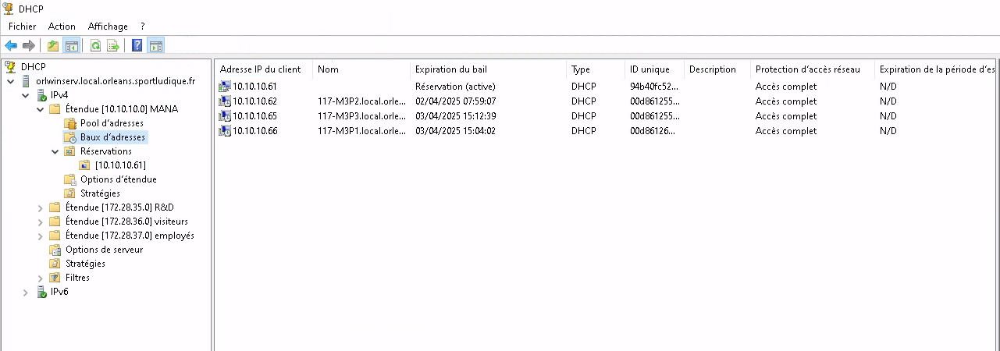

# Configuration d'une borne Wi-Fi Aruba

Pour que nos utilisateurs puissent avoir accées a internet sur leurs ordinateurs sans avoir accées a une prise murale nous allons leurs mettre en place un service Wi-Fi accessible avec leurs identifiant de connection sur l'Active Directory.

## NPS

Le serveur NPS effectue de façon centralisée les processus d’authentification, d’autorisation et de gestion des comptes pour les connexions sans fil, par commutateur d’authentification, par accès à distance et réseau privé virtuel (VPN). Lorsque vous utilisez NPS en tant que serveur RADIUS. 

NPS permet d'assurer que seules les bonnes personnes ont accès au réseau, et qu'elles respectent les règles définies. 

Il utilise souvent un protocole appelé RADIUS pour communiquer avec les équipements réseau (comme les bornes Wi-Fi ou les pare-feu) afin d’appliquer les règles d’accès. 

## Installer un serveur NPS (Network Policy Server) à l’aide du Gestionnaire de serveur :

Sur le WINDOWS SERVER de notre infra, dans le Gestionnaire de serveur, cliquez sur: Gérer, puis sur Ajouter des rôles et des fonctionnalités.  

Dans Sélectionner le type d’installation, vérifiez que Installation basée sur un rôle ou une fonctionnalité est sélectionné, puis cliquez sur Suivant. 

Dans Sélectionner le serveur de destination, vérifiez que Sélectionner un serveur du pool de serveurs est sélectionné. Dans Pool de serveurs, vérifiez que l’ordinateur local est sélectionné. Cliquez sur Suivant. 

Dans Sélectionner des rôles de serveurs, dans Rôles, sélectionnez Services de stratégie et d’accès réseau. Une boîte de dialogue s’ouvre pour demander s’il faut ajouter les fonctionnalités requises pour les services de stratégie et d’accès réseau. Cliquez sur Ajouter les fonctionnalités, puis sur Suivant 

Dans Sélectionner des fonctionnalités, cliquez sur Suivant, puis dans Services de stratégie et d’accès réseau, vérifiez les informations fournies et cliquez sur Suivant. 

Dans Sélectionner des services de rôle, cliquez sur Serveur NPS (Network Policy Server). Dans Ajouter les fonctionnalités requises pour le serveur NPS (Network Policy Server), cliquez sur Ajouter des fonctionnalités. Cliquez sur Suivant. 

Dans Confirmer les sélections d’installation, cliquez sur Redémarrer automatiquement le serveur de destination, si nécessaire. Lorsque vous êtes invité à confirmer ce choix, cliquez sur Oui, puis sur Installer. La page de progression de l’installation indique l’état du processus d’installation.  

## Configuration de NPS comme serveur RADIUS

Dans la console NPS, cliquer sur Stratégies de réseau

Ajouter une nouvelle stratégie d'accès : 

        a: Nommer la stratégie (ex: "accès employés") 

        b: Définir les conditions (ex: groupe d'utilisateurs AD autorisés, type de connexion) 
    

        c: Configurer la méthode d'authentification (PEAP, EAP-TLS, etc.)

Dans Clients et serveurs RADIUS, ajouter un client RADIUS (ex: borne Wi-Fi) en renseignant : 

        a: Son adresse IP ou nom d'hôte 

        b: Une clé secrète partagée pour l'authentification 

## Service ADCS (gestionnaire de certificat)

Installer le service dans “ajout role et fonctionnalité” de l’AD 

Puis, avancez jusqu'à l'étape "Services de rôle" où vous n'aurez qu'à cocher "Autorité de certification". 
Suivant 

Poursuivez la configuration via le lien "Configurer les services de certificats Active Directory" visible dans le Gestionnaire de serveur. 

Pour service de role sélectionner encore autorité de certification

Sélectionnez ensuite "Autorité de certification d'entreprise" et poursuivez. Ce choix est fait, car nous sommes en environnement Active Directory et que nous utilisons qu'un seul serveur. Dans le cas où une hiérarchie de CA est mise en place, cette première autorité de certification sera configurée en tant que CA autonome, puis la CA intermédiaire déployée sur un second serveur, serait une autorité de certification d'entreprise. 

Pour le type d’ac sélectionner autorité de certificat racine  
Clé privéee avec chiffrement SH512 
Nom de l’AC (capture d’ecran) 
Periode de validité : peut importe exemple 10 années  
Laissez par défaut les chemins indiqués pour stocker la base de données des certificats et les logs associés. Poursuivez directement. (capture) 
Faire configurer 

## Joindre cette methode connection a un SSID et un VLAN

Pour pouvoir administrer notre borne Wi-Fi nous avons du créer une pool DHCP car elle ne prend pas en charge l'IP fixe pour le management:

 

Ensuite nous avons activer une réservation d'adresse IP pour l'adresse MAC de la borne Aruba

 

On peut ensuite se connecter via le l'addresse IP de la borne

 

Nous allons créer un SSID pour les employés

 

On lui attribut le VLAN adapté

 

Puis dans l'onglet securité on serlectionne le mode gestion de clés WPA-2-Entreprise puis nous allons ajouter notre serveur d'authentification

 

 Création du serveur d'authentification (Windows Serveur) 

 

 Puis finition en validant la création du Wi-FI

  

