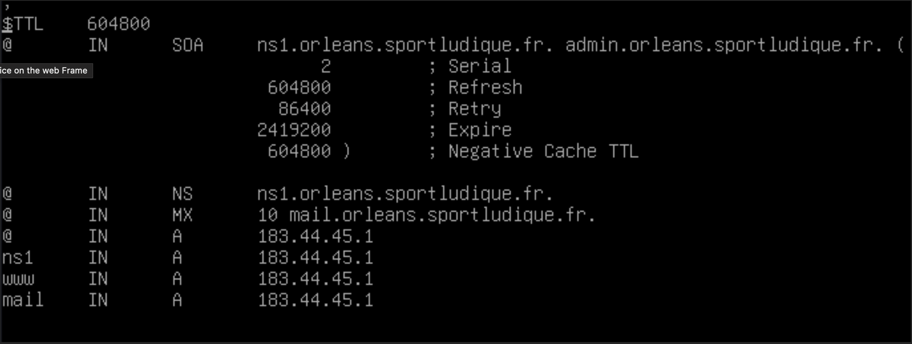
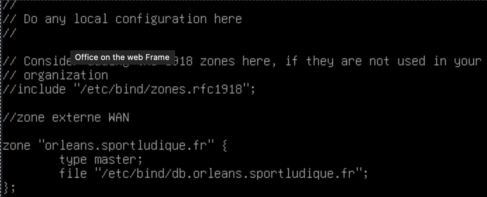
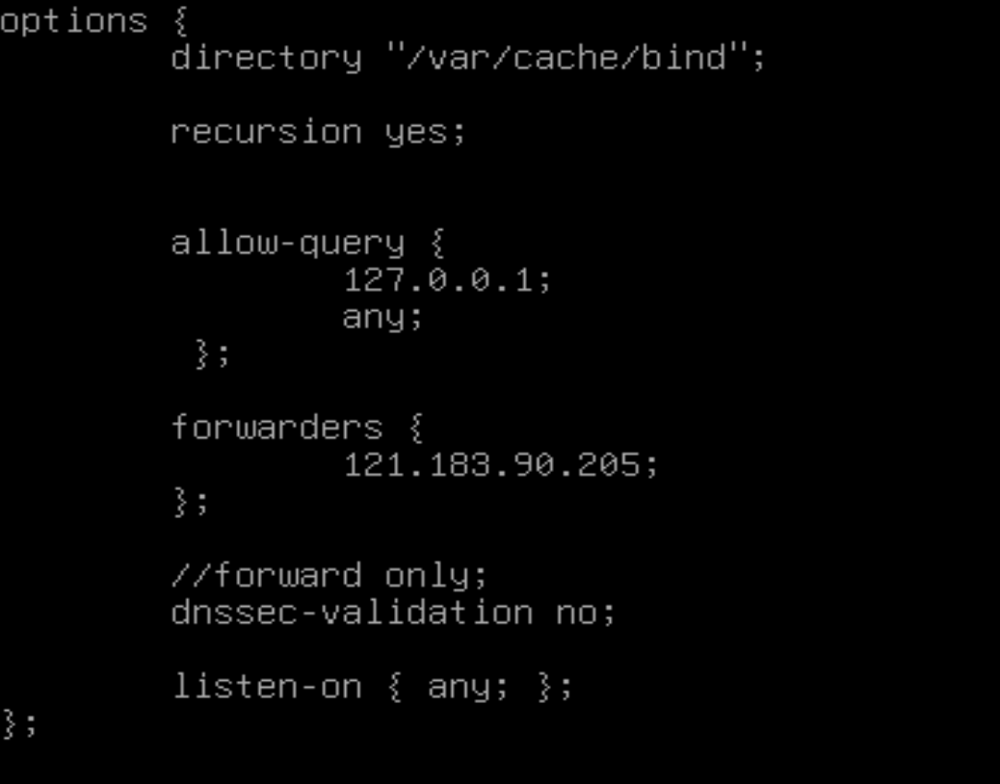
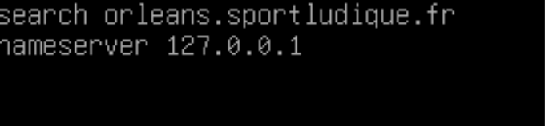

# Configuration du DNS Zone Publique	 

 
Pour mettre en place notre server <strong>DNS</strong> nous allons utiliser une machine DEBIAN vierge. 

Nous allons dans un premier temps mettre à jour notre machine avec les commandes : 

        Sudo apt update

Puis nous pouvons installer le logiciel nécessaire au déploiement du service DNS :

        Sudo apt install bind9 bind9-utils
 

Une fois que nous avons télécharger les fichiers nécessaires nous allons modifier le fichier :  

        /etc/bind/db.orleans.sportludique.fr  

Et le faire correspondre à l’image ci-dessous :

<strong>TTL</strong> : (Time To Live) indique en seconde le temps que mettra la machine client à refaire une demande au serveur dns.  
<strong>NS :</strong> (Name Server) Définit les serveurs DNS autoritaires pour un domaine.  
<strong>MX :</strong> (Mail Exchange) Spécifie les serveurs responsables de la réception des e-mails.  
<strong>A :  =</strong> (Address Record) Associe un nom de domaine à une adresse IPv4.  
<strong>WWW :</strong> (World Wide web) Désigne un serveur Web dans ce réseau.   
<strong>Mail :</strong> Désigne un serveur mail dans ce réseau.  

#### Ensuite nous allons modifier ce fichier: 

        /etc/bind/named.conf.local 
 

Et le faire correspondre à l’image ci-dessous : 

Il sagit de la zone directe que l'on gère localement donc il est important si l'on veut qu’il s’interroge lui-même.

 
 Il faut modifier par la suite ce fichier : 

        Fichier /etc/bind/named.conf.options 

<strong>recursion yes :</strong> Le serveur DNS peut effectuer des requêtes récursives pour résoudre des noms de domaines externes (utile pour les clients locaux).  

<strong>allow-query :</strong> Spécifie les clients autorisés à effectuer des requêtes DNS.  

<strong>Forwarders :</strong> Définit les serveurs DNS externes vers lesquels les requêtes non résolues localement sont redirigées.  

<strong>dnssec-validation :</strong> Active ou désactive la validation DNSSEC (Domain Name System Security Extensions), qui ajoute une couche de sécurité pour vérifier que les réponses DNS proviennent d'une source fiable.  

<strong>Listen – on :</strong> le réseau où il écoute  

 

        Fichier /etc/resolv.conf 

Il est important mettre une adresse IP locale pour qu’il puisse s’interroger lui-même ainsi que son nom de domaine. 

 