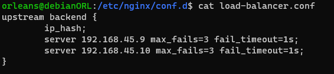

# Load Balencing

>Le Load Balancing permet de répartir le trafic sur plusieurs serveurs pour une meilleure répartition de la charge, sur Nginx 

## 1. Créer un fichier de configuration pour le Load Balancer

   Création du fichier dans le repertoire conf.d pour la configuration du Load Balancer : 

      sudo nano /etc/nginx/conf.d/load-balancer.conf 

## 2. Configuration du Load Balancer  

   Ajoute la configuration suivante pour créer un Load Balancer : 

  

## 3. Activer la configuration  

   Comme pour le Reverse Proxy, crée un lien symbolique dans `sites-enabled` : 

      sudo ln -s /etc/nginx/conf.d/load-balancer.conf /etc/nginx/sites-enabled/ 

## 4. Tester la configuration 

      sudo nginx -t 

## 5. Redémarrer Nginx   

   >Applique les changements en redémarrant Nginx : 

      sudo systemctl restart nginx 

## 6. Vérification

Vérifier que le Load Balancer fonctionne en accédant à l'IP de du serveur Nginx. Le trafic devrait être réparti entre les serveurs configurés dans le `upstream`. 

