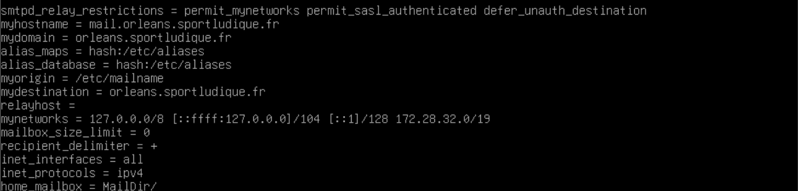

# Configuration Postfix (smtp)(utilisateur en local) 

Pour mettre en place notre server Mail nous avons utilisé une machine DEBIAN vierge. 

 
        sudo apt install postfix –y 

 
N’oubliez surtout pas d’installer les logs 

 
        Sudo apt install rsyslog 

 
Ceci permet d’avoir les erreurs dans le fichier <strong>/var/log/mail.log</strong> ou même les mails envoyés. 

Ensuite on peut configurer le paquet postfix avec cette commande : 

 
        Dpkg-reconfigure postfix 

<table>
    <tr>
      <th>Valeur</th>
      <th>Signification</th>
    <tr>
      <th>Configuration mail type</th>
      <th>Site internet </th>
    <tr>
      <th>Nom courrier</th>
      <th>mail.orleans.sportludique.fr</th>
    <tr>
      <th>Destinataire des mails pour root </th>
      <th></th>
    <tr>
      <th>Autres destinataires</th>
      <th>orleans.sportludique.fr</th>
    <tr>
      <th>Forcer la mise à jour de la sync de la file d'attente</th>
      <th>Oui</th>
    <tr>
      <th>Lan</th>
      <th>127.0.0.0/8 127.28.32.0/19</th>
    <tr>
      <th>Limite de la boite mail</th>
      <th>0</th>
    <tr>
      <th>Protocole internet</th>
      <th>IPV4</th>
    </tr>
  </table>

 Maintenant nous allons éditer le fichier:
 
        /etc/postfix/main.cf

Il nous faut imperativement vérifier les lignes suivantes : 

<strong>Myhostname :</strong> Nom d’hôte complet du serveur 

<strong>Mydomain :</strong> Nom de domaine principal 

<strong>My destination :</strong> Définit les domaines locaux pour lesquels ce serveur accepte les mails 

<strong>Mynetworks :</strong> Réseaux et adresses Ip qui sont autorisées à envoyer des mails via ce serveur sans authentification 

<strong>Home_mailbox :</strong> Répertoire où les emails des utilisateurs locaux seront stockés  

Ensuite on relance le service :

        Sudo systemctl restart postfix 

Ensuite pour tester la conf on peut utiliser la commande : 

        sudo postconf –n 

Vos courrier vont apparaitre dans le fichier <strong>home</strong> de l’utilisateur: 

        /home/Maildir

 

 

 