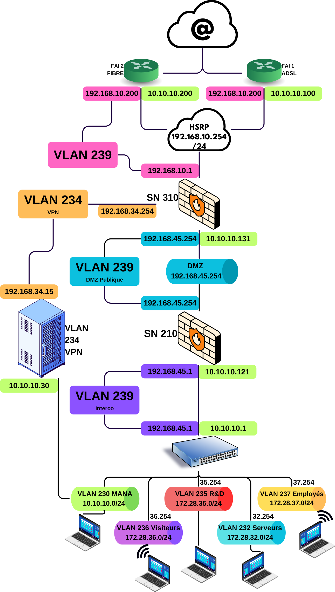

# Réseau 

Rappel du contexte :

  SportLudique, spécialisée dans les articles de sport non convenionnels, est répartie sur quatre sites : Chartres, Tours, Orléans et Châteauroux. L'infrastructure réseau est gérée par le département SISR, responsable de l'exploitation du parc informatique et des projets réseaux.

Les besoins :

  <table>
    <tr>
      <th>Nombre d'utilisateurs</th>
      <th>60</th>
    <tr>
      <th>Nombre de PC fixes</th>
      <th>80</th>
    <tr>
      <th>Nombre de PC portables</th>
      <th>03</th>
    <tr>
      <th>Nombre de serveurs</th>
      <th>11</th>
    </tr>
  </table>
    

## Shéma réseau

