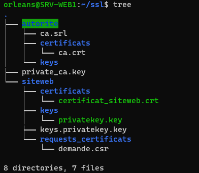

# Certificat SSL avec autorité de certification

Nous allons configurer et activer via notre serveur Apache le protocole de chiffrement SSL/TLS afin que les requetes circulent de façon confidentielle sur internet. Lorsque la communication est effectuée via cette couche de transport chiffrée, un « s » est ajouté au nom du protocole : : http://www.orleans.sportludique.fr  devient https://www.orleans.sportludique.fr . 

Ce certificat est nécessaire pour transférer la clé publique du serveur ainsi que son identité afin d'initier une communication via TLS.  

## 1. Vérification de l’installation d’OpenSSL 

Dans ce cas nous sommes notre propre autorité de certification. 

    openssl version 

## 2. Organisation 

## 3. Création de la clé privée du serveur web :

    openssl genrsa 2048 > siteweb/keys/privatekey.key   

commande pour vérifier le contenu : 

    openssl ec -in privatekey.key -text -noout 

## 4. Génération d'une demande de certificat pour le serveur web : 

    openssl req -new -key siteweb/keys/privatekey.key > siteweb/requests_certificats/demande.csr -config /etc/ssl/openssl.cnf 

> différents champs seront demandés 

Si on veut vérifier notre demande on peut faire la commande :  

    openssl req -in siteweb/requests_certificats/demande.csr -noout -text 

> Création du certificat de l'autorité de certification 

## 5. Création de la clé privée :  

    openssl genrsa -des3 2048 > private_ca.key 

> une pass phrase sera demandé  

## 6. Création du certificat pour la durée :  

    openssl req -new -x509 -days 365 -key private_ca.key > autorite/certificats/ca.crt 

> champs seront demandés comme précédemment 

Signer la demande de certificat : 
    
    openssl x509 -req -in /home/orleans/ssl/siteweb/requests_certificats/demande.csr -out /home/orleans/ssl/siteweb/certificats/certificat_siteweb.crt -CA /home/orleans/ssl/autorite/certificats/ca.crt -CAkey /home/orleans/ssl/private_ca.key -CAcreateserial -CAserial /home/orleans/ssl/autorite/ca.srl -extfile /etc/ssl/openssl.cnf -extensions v3_req

Vérifier son contenu  :

    openssl x509 -in siteweb/certificats/certificat_siteweb.crt -noout -text 

## 7. Configuration du serveur web  

Copier le fichier `/etc/apache2/sites-available/default-ssl.conf` dans son dossier d'origine mais avec le nom du site web donc www.orleans .conf 

(en conservant l'extension .conf pour la commande a2ensite) 

- METTRE PHOTO www.orleans.confpart1-2 

Adapter : DocumentRoot et ServerName, SSLCertificateFile et SSLCertificatekeyfile, rediriger le port 443. 

Activer le module SSL, activer le site, et redémarrer le service comme demandé : 

    a2enmod ssl 

Accéder au site et accepter le certificat et afficher ses informations 

 

## 4. Rajouter certificat dans le navigateur  