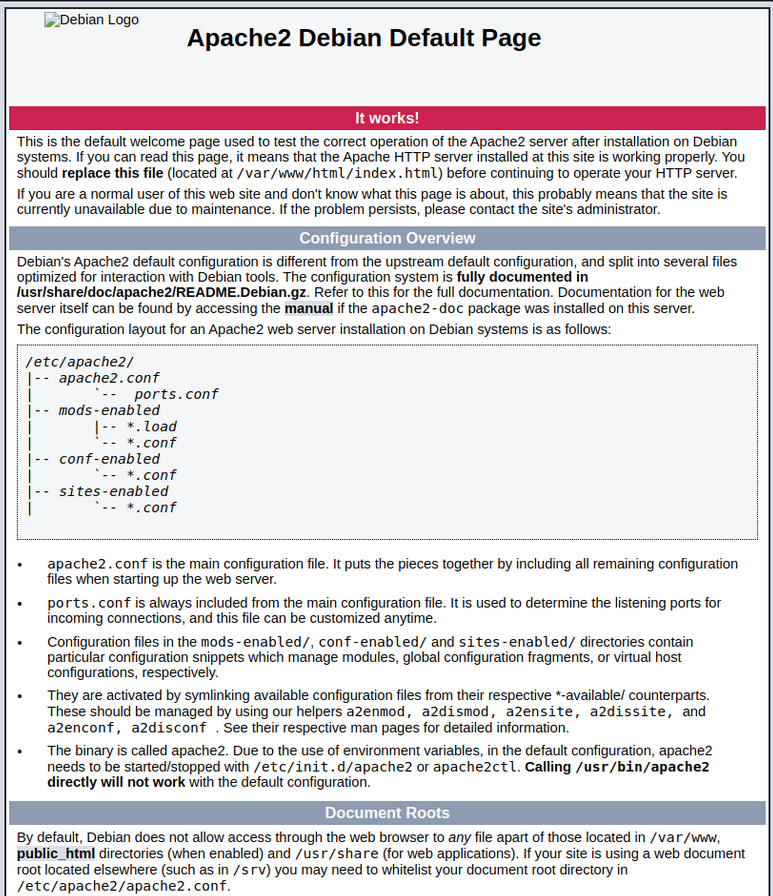

# Serveur Apache

Pour permettre l'accès à notre site web, nous l'avons hébergé sur un serveur Apache. Ce dernier a pour rôle de recevoir les requêtes des navigateurs, qui sollicitent des pages web, de rechercher la page correspondante et de la renvoyer à l'utilisateur.
 

## 1. Installation d'Apache2 

    sudo apt install apache2  

Vérifiez le statut du service Apache : 

    sudo systemctl status apache2 

Testez l’installation : Rendez-vous sur l’adresse IP de la VM dans un navigateur pour voir la page de test Apache par défaut (exemple : http://192.168.45.10). 

Nous devrions obtenir cette page : 

 

## 2. Configuration du site web 

### Créer un répertoire pour le site web : 

    sudo nano /var/www/html/index.html  

### Définir les permissions : 

    sudo chown -R www-data:www-data /var/www/orleans.sportludique.fr 

    sudo chmod -R 755 /var/www/orleans.sportludique.fr 

### Créer un fichier de configuration Apache pour le site : 

    sudo nano /etc/apache2/sites-available/www.orleans.conf 

#### Contenu du fichier : 

> serveur 1 : 

    <VirtualHost *:443>
            ServerName 192.168.45.9       #192.168.45.10 pour le serveur 2
 
            DocumentRoot /var/www/html/
 
            ErrorLog ${APACHE_LOG_DIR}/error.log
            CustomLog ${APACHE_LOG_DIR}/access.log combined
 
        SSLEngine on

            SSLCertificateFile      /etc/ssl/certs/xxxxxx.crt
            SSLCertificateKeyFile   /etc/ssl/private/xxxx.key
 
        <FilesMatch "\.(?:cgi|shtml|phtml|php)$">
                SSLOptions +StdEnvVars
        </FilesMatch>
        <Directory /usr/lib/cgi-bin>
                SSLOptions +StdEnvVars
        </Directory>
            SSLProtocol -all +TLSv1.2 +TLSv1.3
            SSLCipherSuite HIGH:!aNULL:!MD5
            SSLHonorCipherOrder on
 
    </VirtualHost>

### Activer le site et recharger Apache : 

    sudo a2ensite orleans.sportludique.fr 