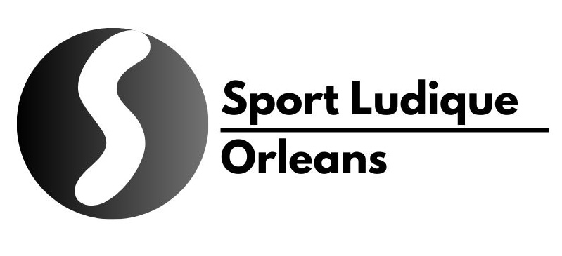

# Bienvenue sur la documentation du projet SportLudique Orleans.

## Contexte du projet

Dans le cadre de notre formation en BTS Services Informatiques aux Organisations (SIO), option Solutions d’Infrastructure, Systèmes et Réseaux (SISR), nous avons pour mission de concevoir une infrastructure réseau complète pour l’entreprise **SportLudique**. Ce projet est une composante clé de notre évaluation en deuxième année (SIO2).

Nous sommes un groupe de trois étudiants : 
- **Erwan BRIET** 
- **Elouenn ROUSSEAU** 
- **Kevin SOULIER** 

## Présentation de l'entreprise

**SportLudique** est une entreprise spécialisée dans la création et la production d’articles de sports non conventionnels. Elle est répartie sur **quatre sites distants** : 
- Chartres 
- Tours 
- Orléans 
- Châteauroux 

L'ensemble de l'infrastructure réseau et informatique de SportLudique est gérée par le département **Solutions d'Infrastructure Système et Réseau (SISR)**. Ce département a pour responsabilité :
- L'exploitation et la maintenance du parc d'équipements.
- La gestion des projets informatiques de l'entreprise.

Cette documentation présente en détail la conception et la mise en œuvre de l’infrastructure réseau proposée pour SportLudique. Vous y trouverez les différentes étapes du projet, les choix techniques, ainsi que les solutions mises en place pour répondre aux besoins de l'entreprise.